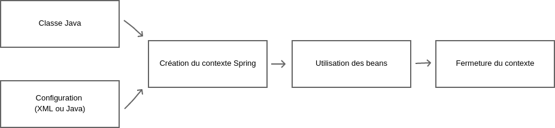

# Cycle de vie

Pour utiliser le moteur Spring, il faut créer un **contexte** à partir de classes Java et d'une configuration.




Exemple de classe Java

```java
package dev.beans;

public class HumanSrv {

    public void sayHello() {
        // ...
    }
}
```


Exemple de configuration (fichier config1.xml).

```xml
<?xml version="1.0" encoding="UTF-8"?>
<beans xmlns="http://www.springframework.org/schema/beans"
       xmlns:xsi="http://www.w3.org/2001/XMLSchema-instance"
       xsi:schemaLocation="http://www.springframework.org/schema/beans http://www.springframework.org/schema/beans/spring-beans.xsd">
    
    <!-- Création d'un bean Spring (singleton par défaut) -->
    <bean id="humanSrv" class="dev.beans.HumanSrv"/>

</beans>
```

Exemple de création de contexte, d'utilisation de bean et fermeture de contexte.

```java
// Création du contexte Spring à partir de la configuration "config1.xml"
ClassPathXmlApplicationContext ctx = new ClassPathXmlApplicationContext("config1.xml");

// Grâce au contexte, il est possible récupérer une instance
 HumanSrv humanService = ctx.getBean(HumanSrv.class);

// Fermeture du contexte 
ctx.close();
```