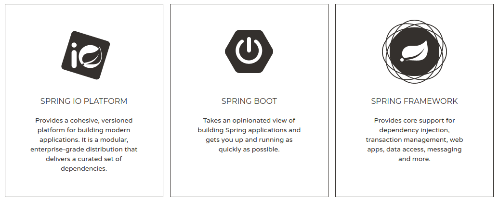
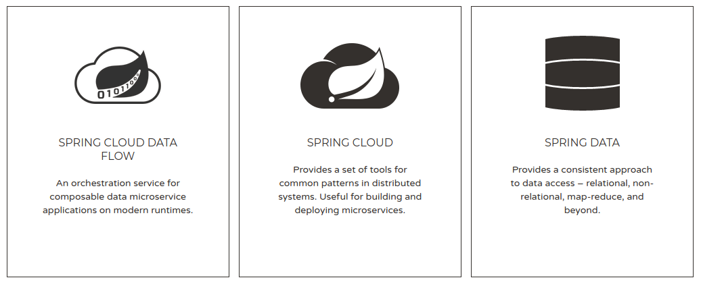
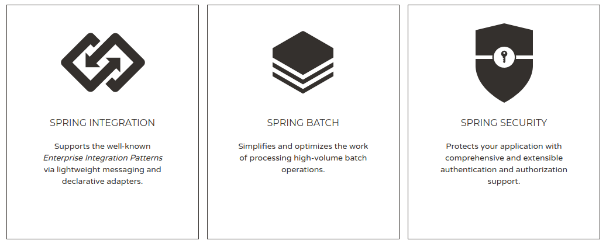
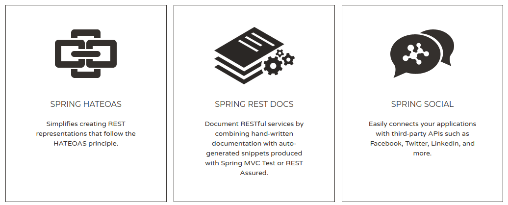
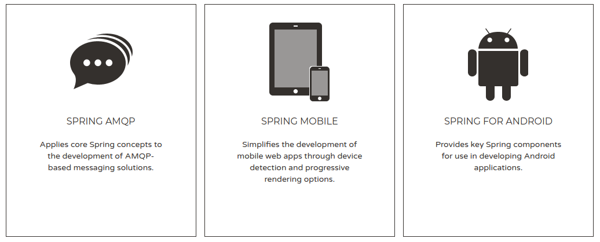
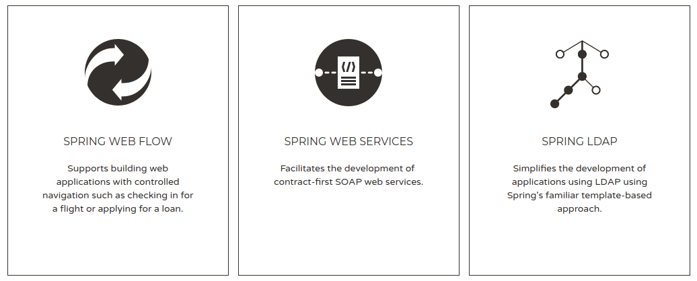
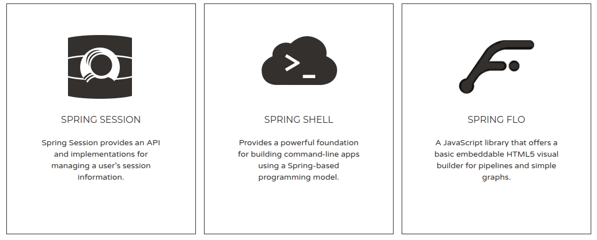
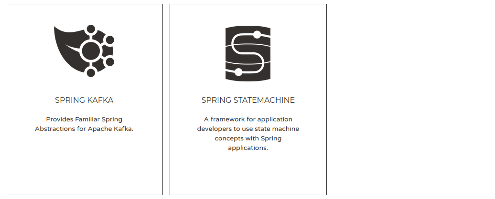
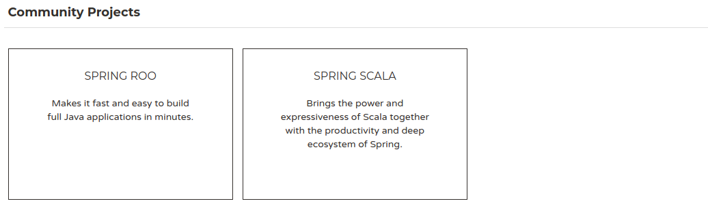
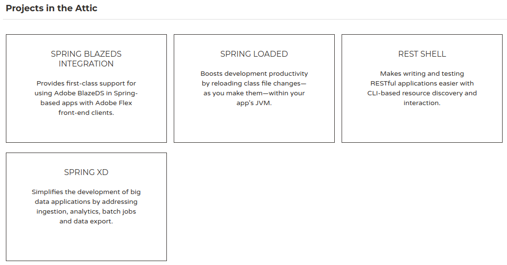

# Spring

Spring est construit comme un ensemble d'outils flexibles
structurant et facilitant le développement d'applications basées
sur la JVM.

Les applications développées avec Spring peuvent aussi bien
être des applications Web que des applications Desktop ou
encore des briques systèmes permettant de traiter de grand
volumes de données.

**Spring c'est plus de 20 projets open source.**

* Sources : https://github.com/spring-projects/
* Spring edite aussi un IDE : Spring Tool Suite (une distribution
d'Eclipse avec des plugins Spring)

**Spring est le framework Java N°1 en Entreprise**.

## Historique

2002
* Rod Johnson publie un livre _J2EE Design and Development_
dans lequel il propose du code qui va devenir le Framework Spring

2004
* Sortie du projet open source Spring 1.0
* Rod Johnson publie un livre "J2EE Development without EJB"
qui explique les limites des EJB et pourquoi utiliser Spring

2005
* Support des annotations avec Spring 2.5

2013
* Spring 4.0 inclut le support de Java 8, Groovy 2, WebSocket, ...

2017
* Spring 5.0 inclut Spring WebFlux

## Vue d'ensemble

