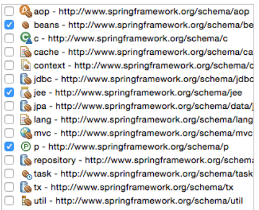

# Espaces de nommage

Spring fournit plusieurs espaces de nommage de configuration.

* `p` : définir des propriétés
* `c` : définir des arguments de constructeur
* `util` : fonctions utilitaires
* ...



Exemple p et c

```xml
<beans xmlns="http://www.springframework.org/schema/beans" xmlns:xsi="http://www.w3.org/2001/XMLSchema-instance" xmlns:c="http://www.springframework.org/schema/c" xmlns:p="http://www.springframework.org/schema/p" xsi:schemaLocation="http://www.springframework.org/schema/beans http://www.springframework.org/schema/beans/spring-beans.xsd http://www.springframework.org/schema/c http://www.springframework.org/schema/beans/c.xsd http://www.springframework.org/schema/p http://www.springframework.org/schema/beans/p.xsd">

    <bean id="animalSrv" class="dev.beans.AnimalSrv"/>
    <bean id="humanSrv" class="dev.beans.HumanSrv"/>
    
    <!--  c => argument du constructeur  -->
    <!--  p => propriété  -->
    <!--  suffixe -ref pour référencer un bean  -->
    <bean id="worldSrv" class="dev.beans.WorldSrv" c:humanSrv-ref="humanSrv" p:animalSrv-ref="animalSrv" p:version="1.3"/>

</beans>
```