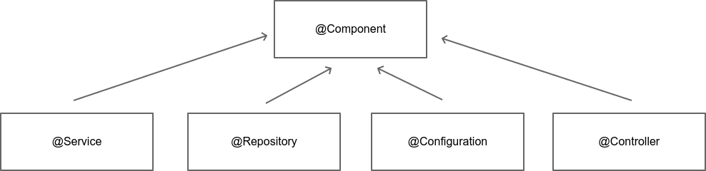

# Stéréotypes

Un stereotype permet de caractériser le rôle d'un bean au sein du contexte

Spring propose "en standard" quelques stéréotypes.

D'autres briques de Spring viennent compléter la liste de ces stereotypes.

* `@Component` : annotation de base d'un bean Spring.
* `@Service` : service métier.
* `@Repository` : accès aux données.
* `@Configuration` : configuration de Spring.
* `@Controller` : intéractions avec utilisateur de l'application.

